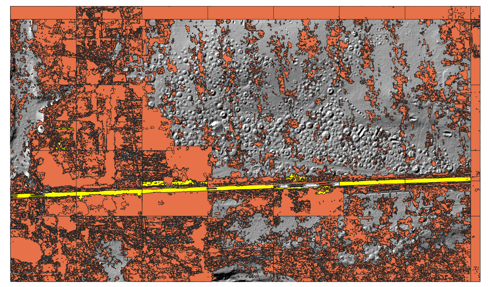
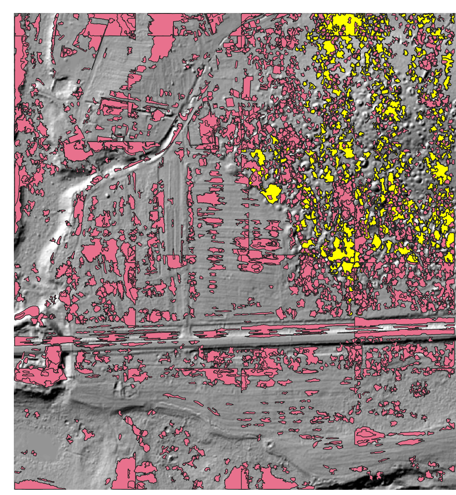
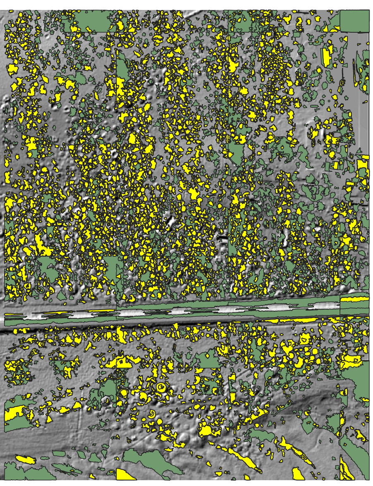

# Результаты

Исходные `.las` файлы обработаны с помощью методов топологического анализа. Выявлены зоны интереса, которые сохранены в векторные файлы. Ссылка: [Google Drive](https://drive.google.com/file/d/1nd0V_m0n8CHs0pEwn3XXL3mLIv_4fjfT/view?usp=sharing).

Использовались три различных метода анализа, каждый из которых лучше подходит для определённых задач:
- `fromZero` — высота анализируется "снизу-вверх". Чаще всего при таком подходе определяются углубления.
- `fromMax` — анализ производится "сверху-вниз", позволяя лучше определить возвышенности и бугры.
- `radius` — сперва выделяются объекты из точек со схожей высотой, затем они расширяются.

Использованный код обработки хранится в файле `main.py` в виде набора функций. Для получения shape-файла из карты высот необходимо вызвать функцию `process_las_file`, передав путь к исходному файлу, выходной путь и экземпляр объекта с настройками чтения и обработки `LasReaderSetup`. Пример работы также представлен в `main.py`. Для обработки сразу нескольких файлов с облаком точек предусмотрена функция `process_multiple_files`.

## Поиск нужных объектов

У каждого объекта в shape-файле есть свойства:
- `id` — уникальный идентификатор в области чтения.
- `ParentID` — идентификатор родительского объекта в области. Если родитель отсутствует, значение равно `4294967295`.
- `Depth` — показатель глубины. У самой верхней (без родительской) области равен `1`.
- `Start` — время появления объекта. Для `fromZero` и `fromMax` выражается в показателе высоты, от которого объект начал разрастаться; для `radius` — показатель схожести начальных точек в компоненте.
- `End` — время исчезновения объекта. Для `fromZero` и `fromMax` выражается в показателе высоты, на котором объект перестал разрастаться; для `radius` — показатель схожести конечных точек.
- `NumPoints` — количество точек в объекте.

По данным свойствам можно производить фильтрацию. Сначала убираются слишком малые и слишком большие компоненты, так как они мешают визуализации:
```SQL
"NumPoints" < 1000000 AND "NumPoints" > 100
```

### Точечный поиск

#### Слой *Ground_2020_Участок 1* из папки *radius*

Следующий фильтр выделит дорогу:
```SQL
"Start" = 0
AND to_real("End") >= 17204 AND to_real("End") <= 17413.33398
AND "NumPoints" >= 82461 AND "NumPoints" <= 112220
AND "Depth" IN (2, 3)
AND area($geometry) < 1000000
```



#### Слой *2020_1 без классификации_ч1* из папки *fromMax*

Следующий фильтр выделит кочкообразные элементы:
```SQL
"NumPoints" >= 2000 AND "NumPoints" <= 210000
AND to_real("Start") >= 20100
AND (
    "End" = -9999 OR (to_real("End") >= 17400 AND to_real("End") <= 30000)
)
AND "Depth" IN (2, 3, 4)
```



#### Слой *2020_1 без классификации_ч2* из папки *fromMax*

Следующий фильтр выделит малые (шумовые) объекты:
```SQL
"Depth" > 2
AND "NumPoints" <= 26000
```



## Как работает алгоритм определения объектов

1. Открывается `.las` файл.
2. Файл читается по кускам (тайлам) с наложением. Это нужно, т.к. исходный размер слишком большой (в рамках потребления ОЗУ) для обработки на домашнем компьютере
3. Точки тайла сужаются и проецируются на матрицу.
4. По матрице строится топологическая характеристика.
5. Из характеристики извлекаются найденные объекты.
6. Объекты векторизируются и проецируются по системе координат файла.
7. Найденные объекты фильтруются и записываются в выходной файл.

В среднем полная обработка (шаги 2-7) одного тайла размером 1600 на 1600 пикселей занимает 79 сек. на процессоре Apple M2.

## Пример использования через утилиту

Запустить утилиту с аргументами (указать корректный путь к `las` файлу):
```bash
LasTopoDec "LiDAR_BIGDATA_GN/Ground_2020_Участок 1.las" output.shp
```

Первым аргументом передаётся исходный `las` файл, вторым – выходной. Также возможно передать опции построения. Их можно посмотреть через вызов справочной информации:
```bash
LasTopoDec -h
```

## Запуск через Python
1. Установить Python версии не ниже `3.11`.
2. Создать виртуальную среду:
```bash
python -m venv venv
```
3. Активировать виртуальную среду:
    - На Windows:
    ```bash
    venv\Scripts\activate
    ```
    - На macOS/Linux:
    ```bash
    source venv/bin/activate
    ```
4. Установить зависимости:
```bash
pip install -r requirements.txt
```
5. Запустить `main.py` или использовать его в своём скрипте. Пример:

```python
preferences = LasReaderSetup()

# В .las точки неравномерны, между x1 и x10 может быть 3-5 точек,
# поэтому нужно уменьшить размерность
preferences.aproximateRectSize = 10

# Целиком обработка файла слишком затратна из-за большого размера.
# Для выполнения обработки на обычном компьютере необходимо разбить на чанки.
# Размер указывается в пикселях после уменьшения размерности.
preferences.chunkSize = 1500

# Так как важные объекты могут быть на границе чанка, нужно брать с захлёстом.
# В идеале размер нахлёста — максимальный размер объекта.
preferences.chunkOversize = 100

preferences.procType = bc.ProcType.Radius

# True — пропускать отсутствующие данные, тогда в обработке ,будут использоваться только существующие точки (области точек).
# False — подставлять на место отсутствующих точек значение по умолчанию (-9999 или 9999).
preferences.useMask = False

process_las_file(las_file_path, output, preferences)
```

## Проекция растра

Чтобы привязать растровое изображение к координатам `.las` файла, написан скрипт `bind_image.py`.
